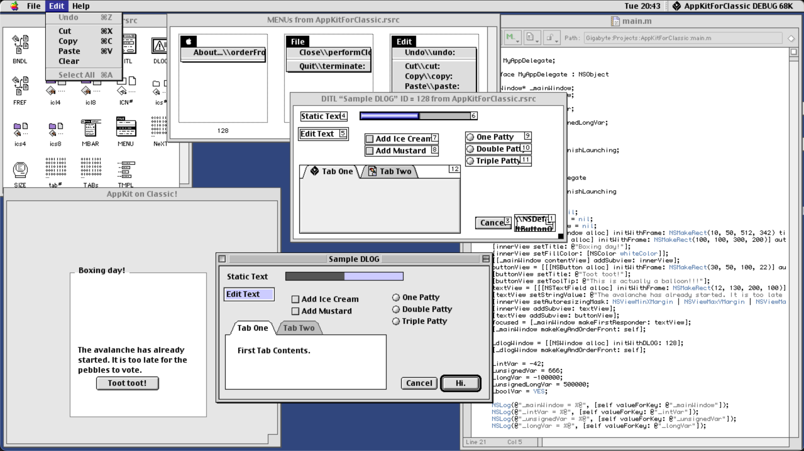

AppKitForClassic
================



What is it?
-----------

A small toy project that reimplements a few bits of AppKit on Classic MacOS on top of the Objective-C compiler included with CodeWarrior Pro.
This uses a modified version of Metrowerks' "MacOS ObjC MiniRuntime" sample code and as such is limited to 680x0 CPUs, but has been retrofitted
to support reference counting and use typical names like NSObject etc.

What is this good for?
----------------------

Nothing, really. It's just a fun hack that might get a laugh out of nerds or impress you with all the things classic MacOS and CodeWarrior were able to do.

What is included?
----------------------

The CheapVersionControl.sit file contains a StuffIt-compressed HyperCard stack that can be used to convert these files from a GitHub-friendly format (Unicode text, Unix line endings, resource fork-only files moved into the data fork, dual-fork files compressed with StuffIt) back into the original Mac format you'd need to run this on an actual Mac or emulator.

Who made this?
--------------

Uli Kusterer of https://zathras.de , https://orangejuiceliberationfront.com and https://hypercard.org
